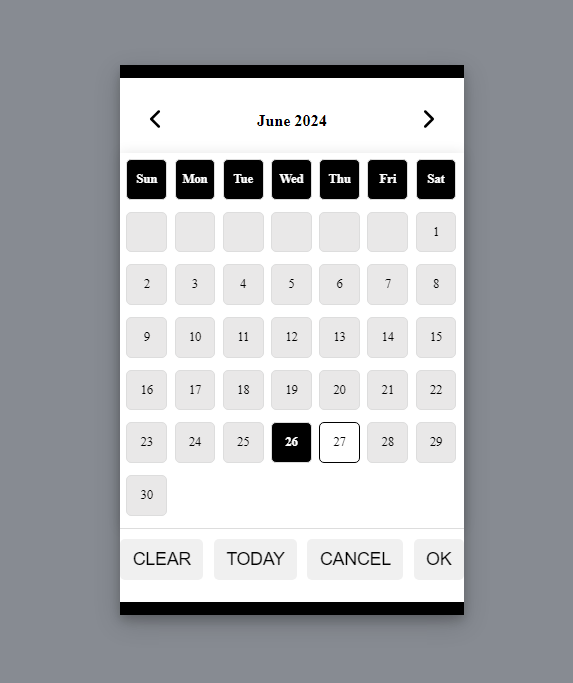
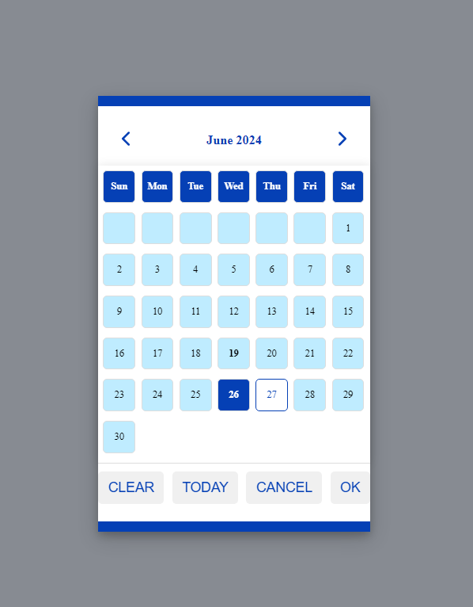

<br />
<div align="center">
  <a href="https://github.com/jacksonpais/daily-selector">
    
  </a>
</div>

### A simple JavaScript Date Selector

- Lightweight
- No dependencies
- Highly customizable UI
- Wide range of features

## Table of Contents

- [Overview](#overview)
- [Features](#features)
- [Secreenshot](#screenshot)
- [Demo](#demo)
- [Installation](#installation)
- [Usage](#usage)
- [Configuration](#configuration)
- [Formatting](#formatting)

## Overview

The **daily-selector** is a lightweight, feature-rich and customizable date selector tool that can be easily integrated into any web application. This utility provides a user-friendly interface for selecting dates, months, and years, with a smooth and responsive design.

## Features

- **Responsive Design**: Ensures the date selector looks great on any device.
- **Month and Year Selection**: Allows users to quickly navigate between months and years.
- **Customizable UI**: Easily change the look and feel to match your application's theme.
- **No External Dependencies**: Pure HTML, CSS, and JavaScript.
- **Feature rich utility**: Offers a wide range of features related to date selector.

## Secreenshot

# Default look



# Primary and Secondary color config



## Demo

Check out the live demo [coming soon].

## Installation

To integrate **daily-selector** into your project, follow these steps:

link directly to the file:

```html
    <script src="./daily-selector.js"></script>
```

## Styles

You will also need to include DailySelector CSS file.

link to the file:

```html
    <link rel="stylesheet" href="./daily-selector.css" />
```

## Usage

**daily-selector** can be bound to an input field:

```html
    <input type="text" id="birthdate" class="daily-selector" />
```

Add the JavaScript to the end of your document:

```javascript
    <script>
        document.addEventListener("DOMContentLoaded", (event) => {
            dailySelector.initialize({
                elementId: "birthdate"
            });
        });
    </script>
```

If you're using **jQuery** :

```javascript
    <script>
        $( document ).ready(function() {
            dailySelector.initialize({
                elementId: "birthdate"
            });
        });
    </script>
```
Only elementId is required compulsorily. All other options of the **daily-selector** help in customizing the **daily-selector**.

More of this is explained in the configuration section.

### Configuration

**daily-selector** in action using all the options available:

```javascript
    <script>
        document.addEventListener("DOMContentLoaded", (event) => {
           dailySelector.initialize({
                elementId: "birthdate",
                includeHeader: false,
                displayFormat: "DD-MMM-YYYY",
                year: {
                    min: 1970,
                    max: 2024
                },
                color: {
                    primary: "rgb(5 64 181)",
                    secondary: "#bfecff"
                },
                closeOptions: {
                    closeOnClickOutsideModal: false,
                    closeOnKeyboardKeys: false,
                }
            });
        });
    </script>
```
Please note: we are in the process of adding more features to our beloved **daily-selector** and the above will be updated.

* `elementId` binds the date selector to a form field
* `includeHeader` adds header to the date selector, this header acts as a text holder for the selected date with date, month year and day. **By default includeHeader is false** 
* `displayFormat` formats date to the selected format, more information on formatting is mentioned in the [next section](#formatting). **By default displayFormat is set to javascript date object** 
* `year` sets the min and max to the limit of year list in date selector. The year has 2 inputs min and max. **By default min is set to current year - 10 and max is set to current year** 
* `color` sets the color to the UI. There is two colors for the date selector ui, primary and secondary. **By default primary color is set to #000000 and secondary color is set to #e9e8e8**. Default UI looks like [this] and color configured UI looks like [this].
* `closeOptions` sets the options for the closing of the modal. Date selector opens on the modal, this configuration helps how to closing of the modal should behave. There are two options in closeOptions - closeOnClickOutsideModal and closeOnKeyboardKeys. The names of the options define its meaning clearly. **By default closeOnClickOutsideModal is set to false and closeOnKeyboardKeys is set to false** 

### Formatting

By default, dates are formatted and parsed using standard JavaScript Date object.

```html
  Wed Jun 05 2020 00:00:00 GMT+0530 (India Standard Time)
```

But it can be formatted with built-in options.

| Built-in Formats | Output                                      |
|------------------|---------------------------------------------|
| D                | Dates - 1, 2, 3, 4, 5,...9, 10, 11          |
| DD               | Dates - 01, 02, 03, 04, 05, ....09, 10, 11  |
| M                | Months - 1, 2, 3, 4, 5,...9, 10, 11         |
| MM               | Months - 01, 02, 03, 04, 05, ....09, 10, 11 |
| MMM              | Months - Jan, Feb, Mar.....                 |
| MMMM             | Months - January, February, March.....      |
| YY               | Years - 22, 23, 24...                       |
| YYYY             | years - 2022, 2023, 2024.....               |
| B                | Days - 1, 2, 3, 4, 5,...9, 10, 11           |
| BB               | Days - 01, 02, 03, 04, 05, ....09, 10, 11   |
| BBB              | Days - Sun, Mon, Tue.....                   |
| BBBB             | Days - Sunday, Monday, Tuesday.....         |

Allowed separators are:
```html
  - / : . , 
```